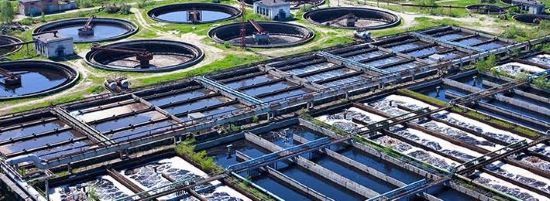

<html>
<head> 
<body style="background-color:Black; width=100% margin:100% padding:100%">
Belinda Harbort Corporate edit.jpg

 <b> Name: </b> Belinda Harbort 

 <b> Student Number: </b> s3832976 

 <b> Email Address: </b> bharbort@outlook.com 

  
 
 

 <b> Background </b>

I wasn’t always based in Melbourne. English speaking only, with a grade 12 education and a number of certificate 3 and 4 ‘s. I am an Australian born Citizen of European decent. My origins are in QLD where I grew up on my parent’s horse stud. I spent many years on the property and at events competing. As I grew so too did my involvement. Each day I would be breaking-in and training multiple horses at various different levels for Endurance, Dressage, Jumping and Showing. Foaling-down as we call it was an intensive period of the year, where I would monitor the mares leading up to delivery of foals. Of high priority was ensuring intensive monitoring of births and assisting mares if there was any difficulty with delivery. The legs are the most common concern as they need to be straight and parallel in order to deliver. Many times, I have had to reach in and readjust the leg position of a foal within a birth canal before the mare would be able to deliver. The shoulders can often be the next problematic structure for the mare to pass, so some assistance may be provided with some gentle tension in the direction of exit in time with the mare’s pushes. 

 From this upbringing I extended myself outside the stud where I could carve my own reliable income and development. The equine industry only goes so far mentally, physically and financially unless you provide a service. Becoming a veterinarian did not appeal to myself. My venture into childcare was more exploratory than desired. Interestingly I didn’t even like children. Still don’t. However, I took on the challenge and came to possess an appreciation for them. My niche was with the children with disabilities, as I learnt to read their behaviour much like I had with horses. I found that this ability I brought to the workplace aided my co-workers and the children in kind. Interesting how much we rely upon vocal and written communication and leave a world of body language unheard. 

When my childcare venture was complete, I acquired myself a placement at the largest Water Treatment Plant in South East QLD. I joined the operators as a Trainee treating water from the Brisbane River and supplying this drinking water to the extremely broad network. While my traineeship contract was to span two years. I became a permanent employee after just one year and spent the following 3 years growing with projects and upgrades until I was performing in a Technical Officer role. In this role I was well placed to stretch my technical expertise and work with a multitude of new stakeholders as we completed one of the largest projects the plant had seen in many years. The most crucial supplier of potable water was to be turned off for a period of three days to install six new valves. The work was the most significant event I was involved in within my career to date and cemented my desire to develop myself further than what training and experience I had been granted as an Operator. While I made moves to different teams, inclusive of Networks and other smaller plants to acquire a work life balance which would enable part time study. Only my flexibility in moving to Melbourne to work for another Government Water Body permitted my entry into study. 

My interest in developing in the IT sector is based partly on my background and partly my enquiring mind. When I was conducting my Traineeship in Water Operations, I would ask senior operators what exactly occurred in the field when they selected a command from a computer screen (SCADA System). It was disappointing to hear responses such as: “I don’t know”, or “We just control”. I felt to be an excellent operator it was important to know what my role affected. Ever in pursuit for information I spent a lot of time with the maintenance crews asking them questions in the field and why a fault had represented in the way it did. How instruments worked and the early signs we could have picked up on were we aware of the equipment involved in processing a command. It was the gradual accumulation of this extra data beyond the certificate training required of operators which led to the opportunities I accepted. The more I pieced automation, processes and equipment together, the more I wanted to know. I can see the water industry becoming fully automated in time. Operators will become less and less common. Some of my peers fear this possibility. My approach is to diversify myself and potentially still work within the same industry for the same outcomes, but create, maintain, improve and ensure reliability of the technology aiding the work. In addition to creating a role for myself which is ever re-moulding. The role of an operator definitely doesn’t possess the same flexibilities. Often there is shift in addition to after-hours work. Work attendance is the same location everyday with the same equipment. ICT as a direction of work is more sustainable as employment for longer, mentally, physically and even financially dependent on interest. This is an appealing concept for my future. While my experience with IT has not been particularly technical. I have worked with a variety of control systems across varying assets to different outcomes. Information garnered from points in these systems are particularly helpful with remote diagnostics. Building trends and analysing pump performance or constructing alarms and timers most effective yet in accordance with original engineering design. A lot of the data I have worked with is of course incorporated within some form of IT application to ensure that water quality test parameters are within legislation and countabilities are recorded during incident and day to day log completion. 
I chose to study with RMIT as while I understand the university supplies a multitude of courses. The use of Technology in the Institution’s name spoke to some focus on Technology. This clearly says more about myself and my perception, rather than what RMIT necessarily wishes to convey. However, this led to myself visiting the website and perusing the courses on offer. While I did look at other universities for the same courses, I found the RMIT course information pages to be more informative and this aided my decision to jump in and start studying now. My partner and I are now both studying outside of work. I was looking for a system that would enable this extra component to our lives without the need to query how the course is travelling. I am a great advocate of structure, and order. To find a course delivered in a structure that suits myself was important.

In my studies I expect to learn information relevant to the industry. I value diverse experience having cultivated it myself and seen the fruits this provides. I think variety is important to be educated in especially due to the broad nature f the IT industry. I know there are parts of the IT industry I am not even aware of, yet would like to learn about. As this is my first step into studying a Bachelor, I’m looking forward to gaining further context on just what options, opportunities, configurations and processes may lead into this industry from the course. I am here to be enlightened. It would please me to learn with others who will also contribute to the charter of this course and if I can share any helpful information from my background. 

</body>
</html>
